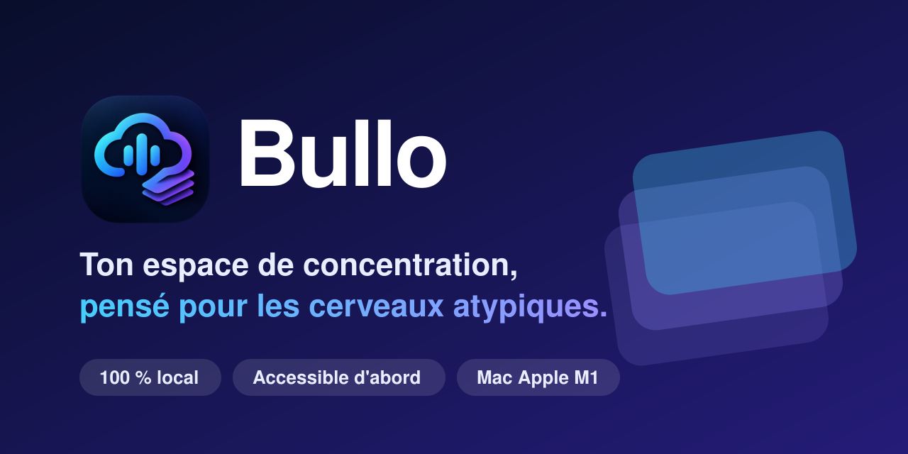
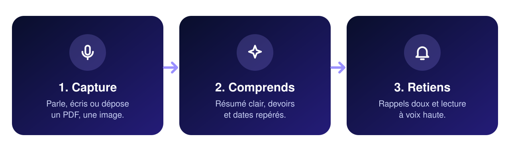
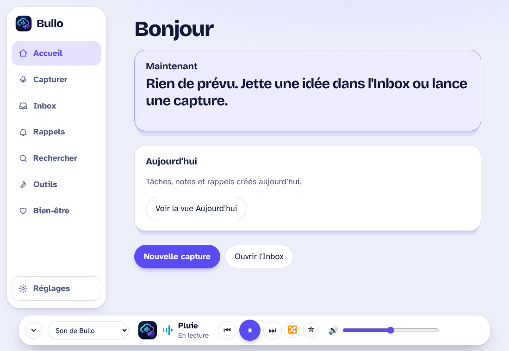
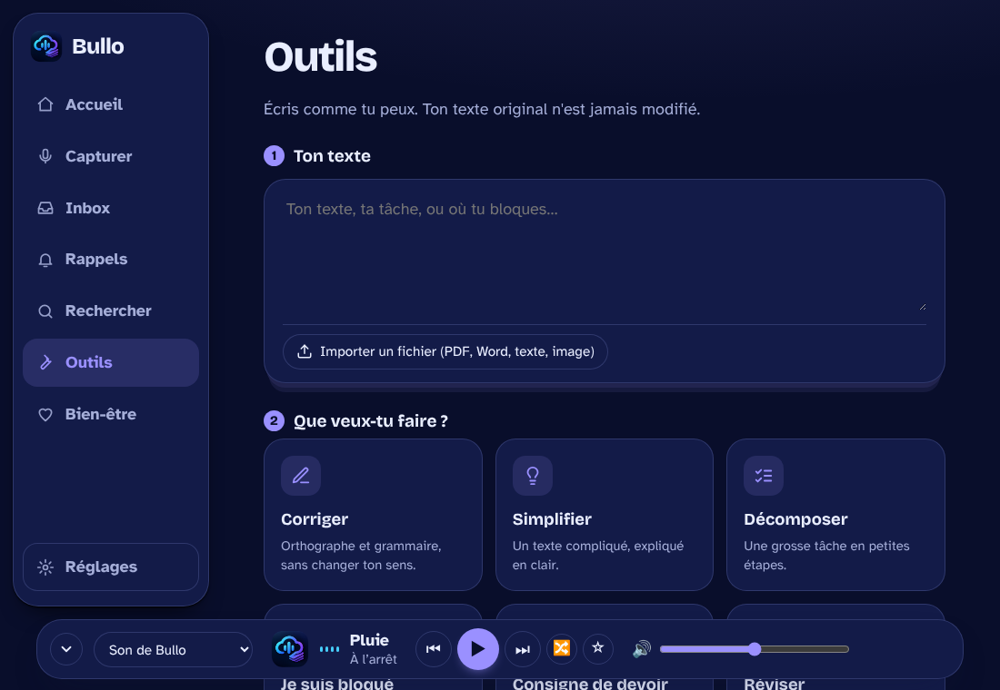
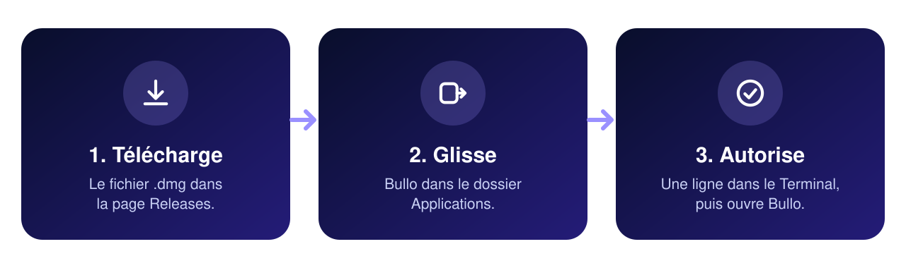

<div align="center">



<br>

[](../../releases/latest)


</div>

**Bullo** aide à capturer, comprendre et retenir ses cours, avec une interface pensée pour les profils dyslexiques, TDAH, autistes ou simplement fatigués. Rien ne quitte ton ordinateur sauf si tu le décides.



## Ce que fait Bullo

| | |
|---|---|
| **Capturer** | Micro, texte, image, PDF ou Word, avec transcription locale |
| **Comprendre** | Résumé, devoirs et dates repérés automatiquement, décomposition en petites étapes |
| **Retenir** | Rappels doux, lecture à voix haute, recherche dans tous tes cours |
| **Se concentrer** | Fond sonore généré par Bullo, ou contrôle de ta musique (Apple Music, Spotify, navigateur) |
| **Se ménager** | Parking de pensées, respiration guidée, pauses douces |
| **S'adapter** | Polices dyslexie, taille, interlignage, thèmes, daltonisme, contraste élevé, mouvement réduit |
| **Sauvegarder** | En local, ou sur ton propre Google Drive (clés protégées dans le Trousseau macOS) |

<p align="center">


</p>

## Installer Bullo



1. Va dans [**Releases**](../../releases/latest) et télécharge le fichier **`Bullo_…_aarch64.dmg`**.
2. Ouvre-le et glisse **Bullo** dans **Applications**.
3. Premier lancement : **clic droit sur Bullo > Ouvrir > Ouvrir**. (Bullo n'est pas encore signé par Apple, macOS demande donc une confirmation une seule fois.)

Ensuite Bullo te guide : il demande l'accès au micro, et propose d'installer lui-même les outils qui lui manquent (FFmpeg, Whisper, Tesseract) via [Homebrew](https://brew.sh).

> **Pour la transcription et le résumé**, deux éléments doivent être présents sur le Mac, une seule fois : le modèle vocal Whisper et [Ollama](https://ollama.com) avec un modèle de langage. Les commandes sont dans la section « Pour les développeurs » ci-dessous. Sans eux, tout le reste fonctionne (notes, rappels, fond sonore, lecture vocale, accessibilité).

## État du projet

Version **1.0.0**. L'interface est testée automatiquement ; les fonctions propres au Mac (micro, AppleScript, Google Drive, notifications) sont en cours de validation. Détail dans [STATUT.md](STATUT.md). Les captures ci-dessus sont des rendus du simulateur.

## Participer

Un bug, une idée ? Ouvre une [Issue](../../issues/new/choose). Pour contribuer au code : [CONTRIBUTING.md](CONTRIBUTING.md). La suite du projet : [ROADMAP.md](ROADMAP.md).

*Vibe codé par Renz-VASA, avec un peu d'intelligence artificielle ✨ · Licence MIT*

---

<details>
<summary><b>Pour les développeurs : lancer le code et fabriquer l'application</b></summary>

### 1. Prérequis (une seule fois)
```bash
xcode-select --install
curl --proto '=https' --tlsv1.2 https://sh.rustup.rs -sSf | sh      # Rust (puis ouvre un nouveau terminal)
brew install node ffmpeg whisper-cpp ollama poppler tesseract tesseract-lang
mkdir -p ~/.bullo && curl -L -o ~/.bullo/ggml-small.bin \
  https://huggingface.co/ggerganov/whisper.cpp/resolve/main/ggml-small.bin
ollama pull qwen2.5:7b
```

### 2. Installer et lancer
```bash
cd bullo
npm install
npm run tauri dev                                     # lance l'application
```
Build de l'application installable : `npm run tauri build`.

### 3. Logo et icônes
Dépose ton fichier **`logo-bullo.jpeg`** dans `src/assets/`, puis :
```bash
npm run logo                                          # génère logo-bullo.png/-512/-256/-64, favicon.ico, icônes Tauri
npm run tauri icon src/assets/logo-bullo.png          # génère aussi l'icône macOS (.icns)
```
Sans ce fichier, Bullo utilise son logo vectoriel `src/bullo-logo.svg` (pas de « ? »).

### 4. Première utilisation
1. Autorise le **micro** quand macOS le demande.
2. **Rappels** : clique sur « Tester la notification ». Si rien n'apparaît : Réglages Système > Notifications > « Éditeur de script » > Autoriser. (Les notifications passent par `osascript`, sans dépendance.)
3. Réglages > Enregistrements et outils > « Vérifier les outils » : FFmpeg, Whisper et le modèle doivent être « Installé ».
4. Lecture vocale : si aucune voix française n'est détectée, Réglages Système > Accessibilité > Contenu énoncé > Voix système.

### Variables optionnelles
- `BULLO_WHISPER_MODEL` : chemin du modèle whisper (défaut `~/.bullo/ggml-small.bin`)
- `BULLO_MODEL` : modèle Ollama (défaut `qwen2.5:7b`)

### Migration depuis FocusFlow
- Au premier lancement, l'ancienne base (`focusflow.db`) est **copiée** vers `bullo.db` (l'ancienne reste intacte). Les anciens enregistrements audio restent lisibles (chemins conservés).
- L'identifiant de l'appli est maintenant `app.bullo.desktop` : macOS redemandera l'autorisation du micro une fois.
- `FOCUSFLOW_*` (variables) et `~/.focusflow/` ne sont lus qu'en repli, pour ne pas casser une ancienne installation. Les anciens réglages de l'interface (`ff_*`) sont migrés automatiquement vers `bullo_*`.

### Structure
- `src/index.html` : interface (Accueil, Capturer, Inbox, Rappels, Rechercher, Outils, Réglages, barre Fond sonore)
- `src/style.css` : styles, thèmes, contraste élevé · `src/fonts/` : polices embarquées
- `src-tauri/src/main.rs` : SQLite, audio, transcription, résumé, rappels et notifications, exports
- `scripts/` : `check-frontend.js` (`npm run build`), `generate-logo-variants.js`
- `PROTOCOLE_DE_TEST.md` : tests à cocher · `STATUT.md` : état réel de chaque fonctionnalité · `PROMPT_BULLO.md` : prompt pour tout régénérer

### Limites connues
Les fichiers audio ne sont jamais inclus dans les sauvegardes. Le contrôle de Music et Spotify passe par AppleScript : macOS demande une autorisation « Automation » la première fois. Lexend et Atkinson se téléchargent depuis Réglages > Apparence (internet requis, une seule fois) ; « Dyslexie » est une police payante qui n'apparaît que si tu l'as installée.

### Importer une image (OCR)
Si Tesseract manque, Bullo affiche un bouton « Installer automatiquement et réessayer » (il lance `brew install tesseract tesseract-lang`, Homebrew requis).

### Mini lecteur : bruit ou ta musique
Le sélecteur de la barre du bas propose deux sources : **Son de Bullo** (ambiances générées : pluie, bruits blanc/rose/brun, café, nature) ou **Son de l'ordinateur**. En mode ordinateur, Bullo détecte ce qui joue : **Apple Music, Spotify, un onglet de navigateur** (Spotify web, YouTube, YouTube Music, Deezer, SoundCloud… dans Safari, Chrome, Arc, Brave, Edge) ou tout autre son (nom de l'appli seulement). Il affiche le **titre**, l'état, et tu peux **lecture/pause, suivant, précédent** (touches média du Mac, ça marche aussi pour le navigateur). Le curseur règle le **volume du Mac**. Le logo Bullo sert de pochette.

**Boucle, aléatoire, favoris** : avec Apple Music et Spotify, les boutons 🔁 (off → tout → ce titre), 🔀 et ☆ agissent dans l'appli (le favori natif existe seulement pour Apple Music ; Spotify ne l'autorise pas). Pour un navigateur, boucle et aléatoire sont grisés (Bullo ne peut pas piloter la page). ☆ garde toujours le titre dans **Mes favoris du lecteur** (Réglages), avec un bouton « Rechercher » sur Spotify. En mode « Son de Bullo », ☆ marque une ambiance favorite, 🔀 passe en aléatoire, et une option permet de ne parcourir que les favoris.

**Opera GX, Opera, Vivaldi** sont reconnus comme les autres navigateurs (onglets musique/vidéo). Le **lecteur intégré de la barre latérale d'Opera GX** n'est pas un onglet : Bullo voit qu'un son joue mais pas son titre, et ne peut le piloter que par les touches média (ça dépend d'Opera GX). **Réglages > Fond sonore > Diagnostic du lecteur** montre exactement ce que Bullo détecte ; envoie-le si ça ne marche pas.

**Autorisations macOS (une seule fois chacune)** : *Automatisation* (Music, Spotify, ton navigateur : pour lire le titre), et *Accessibilité* (pour envoyer les touches média). Réglages Système > Confidentialité et sécurité. Sans Accessibilité, le titre s'affiche mais les boutons ne répondent pas. Le titre d'un navigateur est le titre de l'onglet musique (Firefox n'est pas lisible).

### Icône de l'application
`app-icon.png` est ton logo. Les icônes de `src-tauri/icons/` sont déjà générées ; pour les régénérer proprement : `npm run icon`.

### Pendant un enregistrement
Par défaut (réglable dans Réglages > Fond sonore), Bullo **met en sourdine tout le son du Mac** (navigateur, Spotify, vidéos…), met Music/Spotify en pause, puis remet tout comme avant à l'arrêt (si le Mac était déjà en sourdine, il le reste ; si Bullo se ferme en plein enregistrement, le son est rendu au prochain démarrage).

### Bien-être
Onglet **Bien-être** : parking de pensées (Ctrl+Maj+P depuis n'importe où : tu notes l'idée parasite, tu la tries plus tard, ou tu en fais une tâche), respiration guidée (carrée, 4-7-8, cohérence 5-5, sans animation si « réduire les animations » est activé) et pauses douces (rappel d'eau, d'étirement, de regarder au loin).

### Synchronisation Google Drive
Réglages > Google Drive > « Démarrer le tutoriel » : 6 étapes dans l'appli (projet Google Cloud, API Drive, écran de consentement avec ton Gmail en utilisateur test et le scope `drive.file`, ID client « Application de bureau », envoi des clés, connexion). Ce qu'il te faut est un **ID client OAuth** + son code secret (pas une simple « clé API »).
- Une **empreinte SHA-256** des clés est calculée à l'enregistrement et vérifiée à chaque lecture : si les clés sont modifiées ou corrompues, Bullo le signale (⚠️) et refuse de se connecter. L'empreinte est affichée dans Réglages ; la clé elle-même ne l'est jamais.
- Les clés sont **chiffrées dans le Trousseau macOS** (pas de hachage : Bullo doit pouvoir les relire). Elles ne sont jamais écrites dans un fichier ni dans les réglages.
- Connexion OAuth 2.0 avec PKCE sur une adresse locale (127.0.0.1), accès limité aux fichiers créés par Bullo.
- Sauvegarde : Drive › Bullo › `bullo-sauvegarde.json` (notes, cours, rappels), avec contrôle d'intégrité SHA-256. Restauration avec copie de sécurité `avant-restauration-….json` dans le dossier de données de Bullo. Option de sauvegarde automatique après chaque cours.
- Si Google affiche « n'a pas validé cette appli » : Paramètres avancés > Accéder à Bullo. Si l'appli reste en mode Test, Google peut couper l'accès après environ 7 jours : publie-la en Production ou reconnecte-toi.


### Design (v10)
Refonte visuelle complète (palette tirée du logo : bleu nuit, cyan, violet ; rail de navigation flottant ; cartes empilées comme les feuilles du logo ; lecteur en dock avec barres de son animées). Tout est dans `src/style.css` (couleurs dans `:root`). Les réglages d'accessibilité (contraste élevé, thème doux, daltonisme, polices, mouvement réduit) restent prioritaires sur le design.

### Retiré
Pronote et le carnet scolaire (emploi du temps, notes, import iCal) ont été retirés : la connexion automatique n'est pas possible pour le moment.
### Lecteur léger
En mode « Son de l'ordinateur », Bullo regarde d'abord (très léger) quelle application émet du son, puis n'interroge que celle-là. Il n'ouvre ni n'interroge plus tous les navigateurs.


</details>
